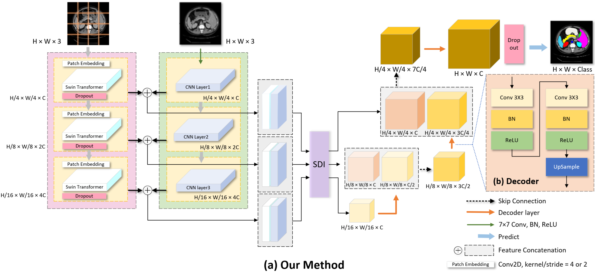
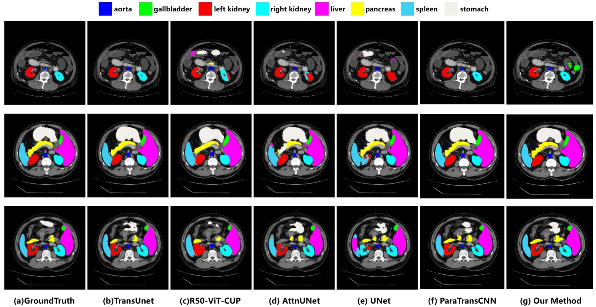
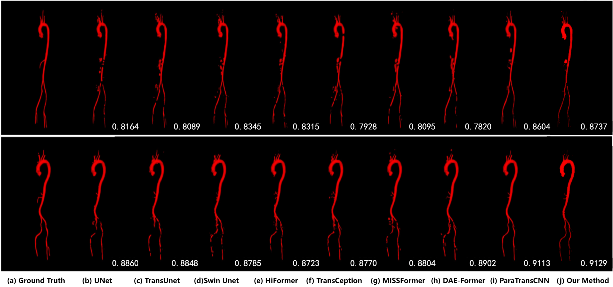

# HybridNet: A hybrid CNN-Transformer network integrating multiscale spatially detailed features for medical image segmentation
This repository contains the official implementation of HybridNet, a lightweight medical image segmentation framework that effectively fuses multi-scale local details from CNNs and global dependencies from Swin Transformers.

* Overview



## 🌟 Key Features

- **Parallel Encoder**: Leverages complementary strengths of CNN and Swin Transformer.
- **SDI Module**: A novel Semantics and Detail Infusion module that filters noise and prioritizes critical anatomical details using attention-based Hadamard product fusion.
- **Lightweight & Efficient**: Designed for practical clinical deployment in resource-constrained environments.
- **Rigorous Validation**: Evaluated with multiple random seeds and compared against SOTA baselines (e.g., ParaTransCNN).

## 🛠️ Requirements

The experiments were conducted on a single NVIDIA RTX A100 GPU.

We use the libraries of these versions:
* Python 3.9.19
* Torch 1.12.1+cu113
* torchvision 0.13.1+cu113
* numpy 1.21.5

Install dependencies via:
```bash
pip install -r requirements.txt
```
## 📂 Dataset Preparation
* Synapse Dataset: please go to "./datasets/README.md" for the details about preparing preprocessed Synapse dataset or download the Synapse Dataset from [here](https://drive.google.com/drive/folders/1ACJEoTp-uqfFJ73qS3eUObQh52nGuzCd?usp=sharing).
* AVT Dataset: please go to "./datasets/README.md" for the details about preparing preprocessed AVT dataset. 

## 🚀 Training & Inference

* Run the following code to train HybridNet on the Synapse Dataset:
```bash
python train.py --datafile_name Synapse --train_path <your path to Synapse train dataset> --model_name HybridNet --max_epochs 250 --T_max 250 --batch_size 32 --base_lr 0.01 
```
* Run the following code to train HybridNet on the AVT Dataset:
```bash
python train.py --datafile_name AVT --train_path <your path to AVT train dataset> --model_name HybridNet --max_epochs 170 --T_max 170 --batch_size 20 --base_lr 0.01 
```
## Test
* Run the following code to test the trained HybridNet on the Synapse Dataset:
```bash
python test.py --datafile_name Synapse --volume_path <your path to Synapse test dataset> --model_name HybridNet --max_epochs 250 --batch_size 32 --base_lr 0.01   
```
* Run the following code to test the trained HybridNet on the AVT Dataset:
```bash
python test.py --datafile_name AVT --volume_path <your path to AVT test dataset> --model_name HybridNet --max_epochs 170 --batch_size 20 --base_lr 0.01 
```
## 📊 Results

### 1. Synapse Multi-Organ (Mean ± SD)

Compared against the strongest baseline ParaTransCNN (retrained under optimal settings):

| Methods         | Avg DSC(%) ↑ | Avg HD(mm) ↓ | Aorta   | GB      | Kidney(L) | Kidney(R) | Liver   | Pancreas | Spleen  | Stomach |
|----------------|--------------|---------------|---------|---------|-----------|-----------|---------|----------|---------|---------|
| ParaTransCNN   | 82.31        | 16.06         | 83.49   | 72.26   | 87.97     | 82.83     | 94.82   | 68.59    | 90.55   | 82.31   |
| HybridNet (Ours)| 84.19±0.49   | 12.64±1.86    | 89.37   | 73.15   | 88.40     | 85.26     | 95.29   | 68.99    | 91.16   | 81.86   |

### 2.  Comparison with State-of-the-Art Methods on Synapse
| Methods                 |          DSC (%) |          HD (mm) |               AO |               GB |               LK |               RK |              Liv |               Pa |               Sp |              Sto |
| ----------------------- | ---------------: | ---------------: | ---------------: | ---------------: | ---------------: | ---------------: | ---------------: | ---------------: | ---------------: |-----------------:|
| R50 U-Net  |            74.68 |            36.87 |            87.47 |            66.36 |            80.60 |            78.19 |            93.74 |            56.90 |            85.87 |            74.16 |
| UNet  |            76.85 |            39.70 |            89.07 |            69.72 |            77.77 |            68.60 |            93.43 |            53.98 |            86.67 |            75.58 |
| R50 Att-UNet |            75.57 |            36.97 |            55.92 |            63.91 |            79.20 |            72.71 |            93.56 |            49.37 |            87.19 |            74.95 |
| Att-UNet   |            77.77 |            36.02 |        **89.55** |            68.88 |            77.98 |            71.11 |            93.57 |            58.04 |            87.30 |            75.75 |
| R50 ViT  |            71.29 |            32.87 |            73.73 |            55.13 |            75.80 |            72.20 |            91.51 |            45.99 |            81.99 |            73.95 |
| TransUNet  |            77.48 |            31.69 |            87.23 |            63.13 |            81.87 |            77.02 |            94.08 |            55.86 |            85.08 |            75.62 |
| TransNorm   |            78.40 |            30.25 |            86.23 |            65.10 |            82.18 |            78.63 |            94.22 |            55.34 |            89.50 |            76.01 |
| Swin UNet    |            79.13 |            21.55 |            85.47 |            66.53 |            83.28 |            79.61 |            94.29 |            56.58 |            90.66 |            76.60 |
| TransDeeplab |            80.16 |            21.25 |            86.04 |            69.16 |            84.08 |            79.88 |            93.53 |            61.19 |            89.00 |            78.40 |
| HiFormer  |            80.39 |            14.70 |            86.21 |            65.69 |            85.23 |            79.77 |            94.61 |            59.52 |            90.99 |            81.08 |
| VM-UNet   |            81.08 |            19.21 |            86.40 |            69.41 |            86.16 |            82.76 |            94.17 |            58.80 |            89.51 |            81.40 |
| MISSFormer |            81.96 |            18.20 |            86.99 |            68.65 |            85.21 |            82.00 |            94.41 |            65.67 |            91.92 |            80.81 |
| TransCeption |            82.24 |            20.89 |            87.60 |            71.82 |            86.23 |            80.29 |            95.01 |            65.27 |            91.68 |            80.02 |
| DAE-Former  |            82.43 |            17.46 |            88.96 |            72.30 |            86.08 |            80.88 |            94.98 |            65.12 |            91.94 |            79.19 |
| ParaTransCNN |            83.49 |            16.06 |            88.61 |            72.26 |            87.97 |            82.83 |            94.82 |            68.59 |            90.55 |        **82.31** |
| **Our Method**          | **84.19 ± 0.49** | **12.64 ± 1.86** | **89.37 ± 0.39** | **73.15 ± 2.76** | **88.40 ± 0.43** | **85.26 ± 0.46** | **95.29 ± 0.11** | **68.99 ± 2.48** | **91.16 ± 1.39** |     81.86 ± 0.82 |

### 3. AVT Performance (Different Seeds)

| Seed | Methods    | All DSC(%) | All HD(mm) | K DSC(%) | R DSC(%) | D DSC(%) |
|------|------------|------------|-------------|----------|----------|----------|
| 1234 | HybridNet  | 88.24      | 5.72        | 85.61    | 85.12    | 94.09    |
| 6910 | HybridNet  | 87.69      | 5.94        | 85.62    | 83.64    | 93.83    |
| 7654 | HybridNet  | 87.91      | 8.25        | 85.77    | 84.25    | 93.69    |
| 9999 | HybridNet  | 87.81      | 8.54        | 86.34    | 83.30    | 93.80    |
| 5399 | HybridNet  | 87.91      | 6.83        | 86.18    | 83.54    | 94.00    |

## 🔍 Visual Analysis

### Visualization on Synapse


### Visualization on AVT



